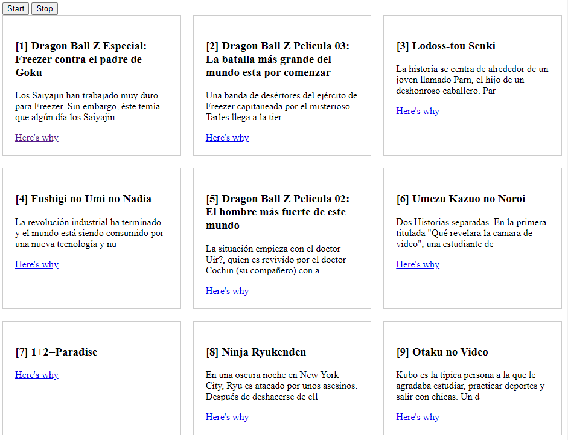

## Webstreams-nodejs-and-browser

Webstreams, best way to process terabytes of data on demand and without crashing.

This project is a practical example where the back-end will use webstreams to read the csv files.
Convert each individual line to json and gradually respond to http requests.

## Database

[List of anime from 1990 to 2022](https://www.kaggle.com/datasets/danielalbarracinm/list-of-anime-from-1990-to-2022?resource=download)

This dataset is composed of more than 3400 anime series from 1990 to June 20, 2022. The data were obtained from the website animeflv.net. A well known website for anime series viewing.

## Screenshot

## Learn More

- [Using writable streams](https://developer.mozilla.org/en-US/docs/Web/API/Streams_API/Using_writable_streams)
- [Streaming requests with the fetch API](https://developer.chrome.com/articles/fetch-streaming-requests/)
- [Fetch API, Streams API, NDJSON, and ASP.NET Core MVC](https://www.tpeczek.com/2019/04/fetch-api-streams-api-ndjson-and-aspnet.html)
